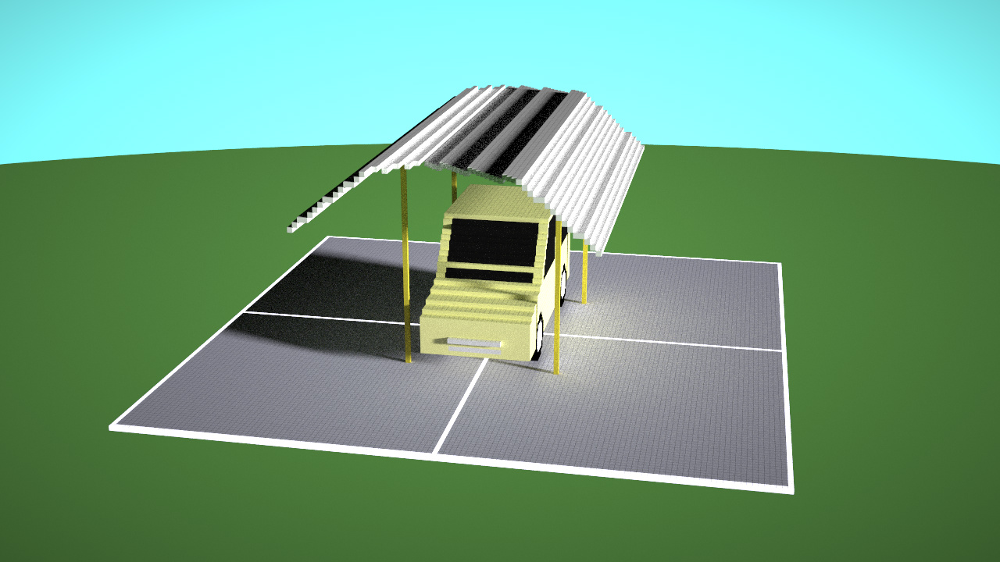
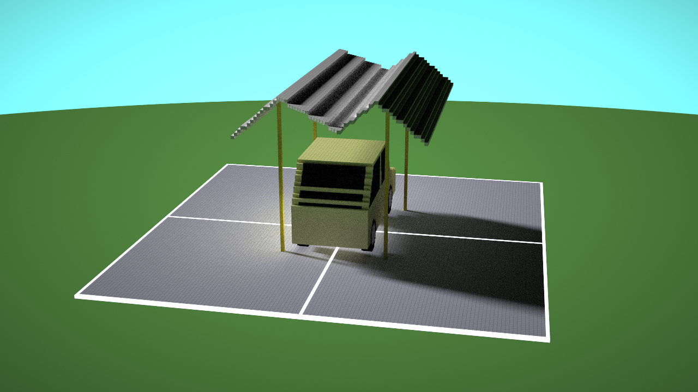

# <a name="title">Taichi Voxel Challenge: Ambiguous Garage Roof</a>

</img>
</img>

> Figure: garage roof and car seen from front and back in precisely the same settings.

## References

The short program is a simplified demo for one work borrowed from [Ambiguous Objects by Dr. Kokichi Sugihara](http://www.isc.meiji.ac.jp/~kokichis/Welcomee.html).

The roof is seen as to be in different shape from special angles at front and back. But the real shape is in four irregular plates.

## Program style

The code is written in a bad style to fit within lines and words limits.

## Implementation

The central idea is heavy use of functions to generate pixels of quadrilatterals especially parallelograms by interpolation to integer indexes while scanning along one direction for simplication. Then all parts(plates) for the roof and the car follow.

## Screenshot and animation show

As special camera angles are needed for displaying, customized scene.py is used only for screenshot and development.

Launching `python3 main.py` uses original `scene.py`. While launching `python3 main_display_rotate.py` will utilize `scene_autorotate.py` with UI controlling modifications.

The modification includes:

+ Auto rotation. Switched on/off by pressing 't'.
+ Set camera angle to front by pressing 'b'.
+ Set camera angle to back by pressing 'n'.
+ Manually rotates camera angle little by little by pressing 'm'.

</img>

> Animation to show rotation by 360 degrees.

## Problems

Lighting and car shape are too ugly. Needs enhancement, maybe including advanced algo and ideas.

Codes needs to be more elegant for better representation power and also compressing code size.
